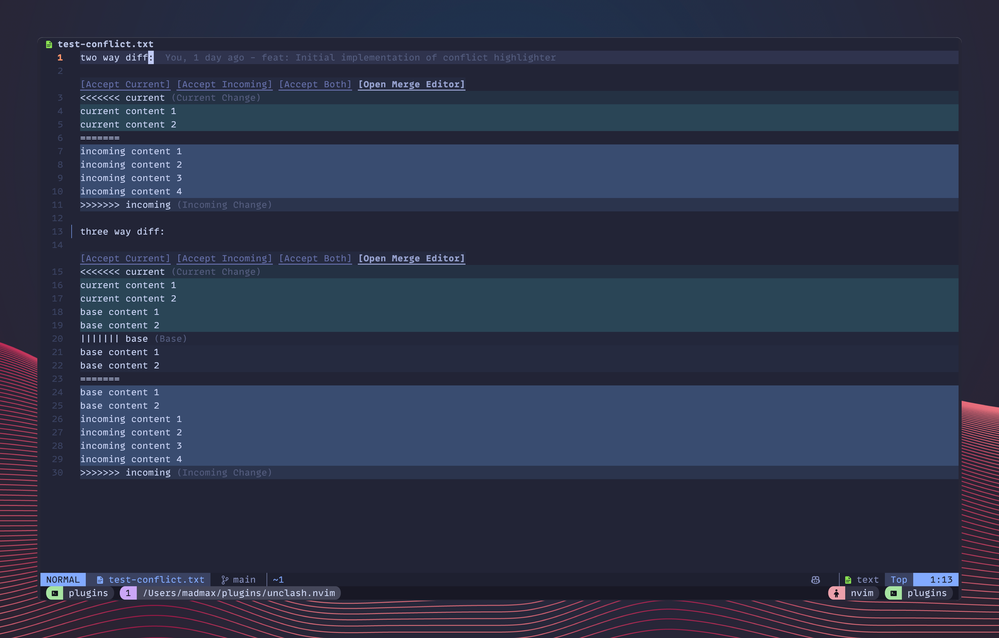
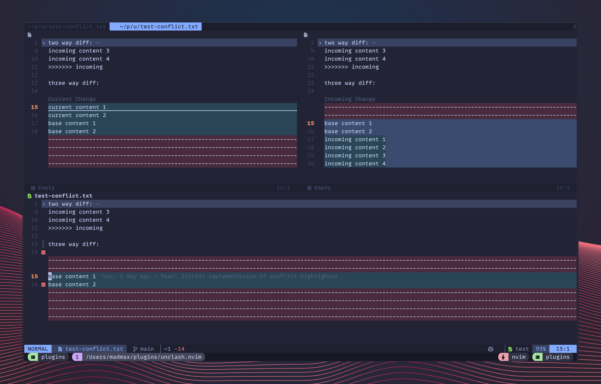

# unclash.nvim

A lightweight, feature-rich merge conflict manager for Neovim, written in Lua.

`unclash.nvim` automatically detects, highlights, and helps you resolve merge conflicts with ease. It includes a 3-way merge editor, clickable actions, and seamless integration with existing tools.




## Features

- **Automatic Detection**: Automatically detects conflicted files in your working directory and highlights them when opened.
- **More than git**: Works with any text file containing standard conflict markers (`<<<<<<<`, `=======`, `>>>>>>>`).
- **Smart Highlighting**: Distinct highlighting for Current, Incoming, and Base changes to easily visualize conflicts.
- **Action Lines**: Virtual text buttons above each conflict allowing you to resolve them with a mouse click (`[Accept Current]`, `[Accept Incoming]`, etc.).
- **3-Way Merge Editor**: Opens a specialized tab layout with the Result, Current, and Incoming views side-by-side.
- **Navigation**: Jump between conflicts easily.
- **Quickfix / Trouble Integration**: Populate the quickfix list or [Trouble.nvim](https://github.com/folke/trouble.nvim) with all detected conflicts.

## Installation

### [lazy.nvim](https://github.com/folke/lazy.nvim)

```lua
{
  "madmaxieee/unclash.nvim",
  lazy = false, -- unclash is lazy-loaded by default
  -- there is currently no configurable options, any suggestions are welcome!
}
```

## Usage

`unclash.nvim` works out of the box. Just open a file with conflict markers.

### Commands

| Command                  | Description                                                                     |
| ------------------------ | ------------------------------------------------------------------------------- |
| `UnclashAcceptCurrent`   | Accept the "Current" changes for the conflict under the cursor.                 |
| `UnclashAcceptIncoming`  | Accept the "Incoming" changes for the conflict under the cursor.                |
| `UnclashAcceptBoth`      | Accept both changes for the conflict under the cursor.                          |
| `UnclashOpenMergeEditor` | Open the 3-way merge editor for the current file.                               |
| `UnclashQf`              | Add all conflicts in the workspace to the Quickfix list.                        |
| `UnclashTrouble`         | Show all conflicts using [Trouble.nvim](https://github.com/folke/trouble.nvim). |

### Lua API & Keybindings

`unclash.nvim` does not set default keybindings (except for mouse clicks on action lines). You can set your own mapping in your config:

```lua
local unclash = require("unclash")

vim.keymap.set("n", "]x", unclash.next_conflict, { desc = "Next Conflict" })
vim.keymap.set("n", "[x", unclash.prev_conflict, { desc = "Prev Conflict" })
vim.keymap.set("n", "<leader>co", unclash.open_merge_editor, { desc = "Open Merge Editor" })

-- Helper to accept conflicts
vim.keymap.set("n", "<leader>cc", unclash.accept_current, { desc = "Accept Current" })
vim.keymap.set("n", "<leader>ci", unclash.accept_incoming, { desc = "Accept Incoming" })
vim.keymap.set("n", "<leader>cb", unclash.accept_both, { desc = "Accept Both" })
```

### Merge Editor

When you run `:UnclashOpenMergeEditor` or click `[Open Merge Editor]`:

1. A new tab opens.
2. The **Result** buffer (the actual file) is on the left (or top depending on layout).
3. **Current Changes** and **Incoming Changes** are displayed in split windows for comparison.
4. Updates to the conflict in the Result buffer will close the editor automatically when resolved.

## Highlights

The plugin defines the following highlight groups, which link to standard diff groups by default:

- `UnclashCurrent`: Background for current changes (Links to `DiffAdd`)
- `UnclashIncoming`: Background for incoming changes (Links to `DiffText`)
- `UnclashBase`: Background for base changes (Links to `DiffChange`)
- `UnclashAnnotation`: Text color for annotations (Links to `NonText`)

You can override these in your color scheme or config.
